# OpsRadar v1 功能需求设计文档

> 适用场景：产品需求评审、研发拆分、接口设计、数据库建模、测试验收、项目汇报。
>
> 文档定位：本文件是 OpsRadar v1 的功能需求与概要设计说明，目标是保证首页、资源中心、应用环境、巡检模板、巡检任务、报告、问题闭环和 AI 能力都能落地实现。接口字段以实现阶段的 OpenAPI / 数据库迁移为准，本文件定义业务边界、页面能力、核心对象和验收标准。

## 1. 项目概述

### 1.1 项目名称

OpsRadar 运维自动化巡检管理平台。

### 1.2 项目定位

OpsRadar 是一个面向运维场景的 AI 智能巡检与问题闭环平台。系统以“应用环境”为巡检组织中心，将主机、数据库、缓存、中间件、容器、Kubernetes、日志源、监控源等运行资源纳入统一管理，通过内置指标仓库、巡检模板、规则集、任务调度、异步执行、报告导出、异常管理和 AI 诊断，形成从资产纳管到巡检执行、异常分析、报告沉淀、问题处置和复测验证的完整闭环。

当前架构以 `opsradar-api`、`opsradar-web`、PostgreSQL、Redis 和分布式 `opsradar-worker-agent` 为核心。v1 功能设计优先保证控制面、执行面和 AI 编排边界清晰，支持 Docker Compose 起步部署，并保留更多数据源、Worker 横向扩展和更复杂 AI Orchestrator 的演进空间。

### 1.3 建设背景

传统运维巡检通常存在以下问题：

| 问题 | 表现 |
| --- | --- |
| 巡检过程依赖人工 | 运维人员手动登录服务器执行命令，耗时且容易遗漏 |
| 巡检标准不统一 | 不同人员、不同系统使用的命令和阈值不一致 |
| 结果缺乏沉淀 | 巡检输出分散在终端、文档或聊天记录中，难以追溯 |
| 异常闭环不足 | 发现问题后缺少统一的问题记录、分析建议和处理状态 |
| 周期巡检成本高 | 每日、每周重复检查需要大量人工操作 |
| 应用视角缺失 | 只关注单台机器，缺少对业务系统整体环境健康度的判断 |
| 监控日志割裂 | Prometheus、VictoriaMetrics、VictoriaLogs、Grafana 与巡检结果没有形成证据链 |
| AI 难落地 | AI 如果只做自由问答，无法真正连接资产、任务、报告、问题和修复流程 |

OpsRadar 的设计目标是将运维巡检从“人工命令执行”升级为“平台化、标准化、自动化、可追溯”的运维能力。

### 1.4 建设目标

| 目标 | 说明 |
| --- | --- |
| 资产统一纳管 | 支持批量导入服务器，支持对接 JumpServer 同步主机、账号、连接方式、IP、名称、标签等信息 |
| 应用环境建模 | 以业务应用和运行环境为核心组织资源，例如 `devops-prod` 环境绑定主机、中间件、数据库、监控源和日志源 |
| 指标仓库沉淀 | 内置 OS、Docker、中间件、数据库、Kubernetes、CIS 安全基线等巡检指标，支持自定义指标和脚本 |
| 规则集可编排 | 支持按资源类型、环境、业务系统创建规则集，将指标、脚本、判定规则组合成可复用巡检模板 |
| 任务自动化执行 | 支持一次性巡检、周期巡检、任务日志、并发控制、失败重试、通知规则和任务取消 |
| 异常自动生成 | 巡检失败或异常时自动生成问题记录，沉淀指标、日志、命令输出、监控查询和历史报告证据 |
| 报告自动导出 | 支持 HTML 在线预览、DOCX、PDF 报告输出，报告中包含 AI 综合诊断、根因分析和修复建议 |
| 问题闭环处置 | 问题支持详情、AI 分析、证据链、一键修复、修复建议、修复任务、复测和关闭 |
| 安全可控 | 支持 JWT 登录、RBAC 权限、凭据加密、敏感信息脱敏、审批确认和审计日志 |
| AI 能力落地 | AI 作为助手和诊断编排层，连接模型、数据源、知识库、任务、报告、问题和修复流程 |

### 1.5 v1 落地范围

v1 以“能纳管、能巡检、能出报告、能生成问题、能 AI 辅助分析、能闭环处理”为交付边界。

| 范围 | v1 必须支持 | v1 暂不强制 |
| --- | --- | --- |
| 资源 | 主机、数据库、Redis、Docker/Compose、日志源、监控源配置 | 完整 CMDB、多云自动发现 |
| 导入 | Excel/CSV 批量导入、JumpServer API 同步入口 | 双向同步、账号实时托管 |
| 环境 | 应用、环境、资源绑定、资源角色、标签 | 复杂拓扑自动绘图 |
| 指标 | 内置指标、规则集、自定义 shell/sql/redis 脚本、基础判定规则 | 图形化脚本 IDE |
| 巡检 | 一次性任务、周期任务、通知规则、任务日志、报告生成 | 超大规模分片调度 |
| 问题 | 自动生成、详情、AI 分析、证据链、修复建议、复测 | 全自动无人值守修复 |
| AI | 模型配置、对话助手、RAG 知识库、报告诊断、根因分析 | 复杂多 Agent 自主编排 |

## 2. 系统总体设计

### 2.1 总体架构

系统采用“中心控制面 + 分布式 Worker Agent”的架构。`opsradar-api` 负责 REST API、认证授权、资源与任务控制、调度、AI Orchestrator、报告和审计；`opsradar-worker-agent` 负责巡检、复测、修复、脚本执行和结果上报。PostgreSQL 作为事实数据源，Redis 用于分布式锁、调度协调、限流、Worker 心跳和临时状态。

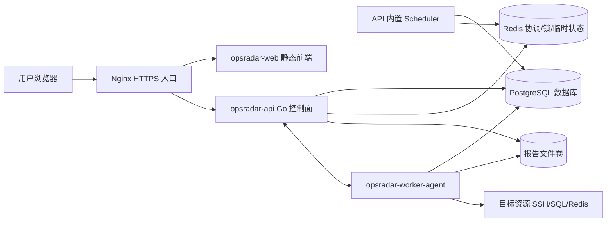

### 2.2 架构分层

| 层级 | 组成 | 主要职责 |
| --- | --- | --- |
| 展示层 | `opsradar-web`，Vue 3 + TypeScript + Vite | 单页管理台、AI 工作台、资源、任务、问题、报告、审计、设置 |
| 接口层 | `opsradar-api` REST API | 提供认证、资源、应用环境、巡检任务、报告、问题、AI、用户权限等 API |
| 业务服务层 | API 内部 service / manager / orchestrator 模块 | 巡检任务创建、调度、报告生成、加密脱敏、RBAC、AI 工作流、服务发现、健康分析 |
| 执行控制层 | API 内置 Scheduler、Dispatcher、Worker Gateway | 周期任务扫描、任务派发、Worker 接入、进度与日志回写 |
| Worker 执行层 | `opsradar-worker-agent` | 接收任务、控制并发、注入凭据、执行巡检/复测/修复、上报结果 |
| 数据持久层 | PostgreSQL schema / migration | 存储用户、角色、资源、环境、模板、任务、结果、报告、问题、审计、AI 工作流 |
| 基础设施层 | PostgreSQL、Redis、Nginx、Docker Compose | 数据库、协调缓存、反向代理、TLS、容器化部署 |

### 2.3 技术选型

| 技术 | 使用位置 | 选型原因 |
| --- | --- | --- |
| Go | 后端 API 与 Worker Agent | 适合控制面服务、长连接 Worker Gateway、并发调度和单二进制部署 |
| Gin 或 Chi | HTTP API | 轻量、生态成熟，适合 REST API 和中间件扩展 |
| PostgreSQL | 主数据库 | 可靠性高，支持 JSON 字段，适合结构化业务数据和配置数据 |
| PostgreSQL + pgvector | 知识库向量检索 | v1 减少组件数量，直接在 PostgreSQL 内支持 RAG 检索 |
| Redis | 缓存与协调 | 支持分布式锁、调度锁、限流、Worker 心跳和临时上下文 |
| gRPC 双向流 | Worker 通信 | Worker 主动连接控制面，适配跨网段和客户现场部署 |
| Go SSH / SQL / HTTP / K8s Executor | Worker 原生执行器 | 覆盖主机、数据库、HTTP/API、Kubernetes 等巡检目标 |
| Ansible Runner | 可选执行后端 | 复用已有 playbook、roles、inventory、facts 和 Ansible 模块能力 |
| Nginx | 反向代理 | TLS 终止、HTTP 到 HTTPS 跳转、统一入口 |
| Vue 3 + TypeScript + Vite | 前端控制台 | 适合构建企业级后台、模块化页面和复杂交互 |
| Docker Compose | 交付部署 | 快速拉起完整运行栈，便于单机生产或演示环境部署 |
| OpenAI-compatible API | AI 模型接入 | 统一适配 OpenAI、DeepSeek、Qwen、Ollama、vLLM 等模型 |
| Playwright / Chromium | PDF 导出 | 将 HTML 报告渲染为 PDF |
| DOCX 导出组件 | DOCX 报告 | 生成可编辑巡检报告，具体实现由 Worker 报告执行器承载 |
| Prometheus / VictoriaMetrics API | 指标数据源 | 支持监控指标进入巡检判定和问题证据链 |
| VictoriaLogs API | 日志数据源 | 支持日志检索进入 AI 分析和证据链 |

## 3. 功能模块设计

### 3.0 页面与导航范围

v1 左侧导航建议与设计图保持一致：

| 导航 | 页面定位 | v1 关键能力 |
| --- | --- | --- |
| 首页 | AI 智能巡检助手和 AI 专属侧栏 | AI 对话、快捷创建巡检、异常分析、生成报告、AI 洞察、AI 风险识别、AI 下一步建议 |
| 资源 | 资源中心和资源分类入口 | 全部资源、最近巡检、收藏视图、分类卡片、批量导入、JumpServer 同步、应用环境绑定 |
| 任务 | 巡检任务与周期计划 | 一次性任务、周期任务、任务执行日志、任务重跑、取消、报告入口 |
| 问题 | 巡检问题闭环 | 问题列表、详情、AI 根因、证据链、修复建议、一键修复、复测 |
| 报告 | 巡检报告归档 | HTML 预览、DOCX/PDF 导出、历史报告、AI 综合诊断 |
| 审计 | 操作与安全审计 | 登录、资源变更、任务执行、修复审批、AI Action 调用 |
| 设置 | 系统配置 | 用户角色、通知渠道、模型 Provider、数据源、知识库、站点设置 |

首页参考设计图中的“AI 智能巡检助手”不是静态欢迎页，而是可操作入口：用户可以直接输入“帮我对 devops-prod 做一次数据库和 OS 巡检”，系统应识别环境、资源范围、规则集和执行配置，缺少信息时引导补齐。

首页右侧为 AI 工作台专属侧栏，不做普通业务概览。侧栏由三类 AI 结果组成：

- AI 洞察：展示最近更新时间、核心摘要、辅助说明和风险识别、潜在任务、趋势变化三个小指标。
- AI 风险识别：展示 AI 已识别出的风险项，每条包含标题、资源名称/IP 和风险等级。
- AI 下一步：展示 AI 基于当前风险给出的建议动作，每条包含建议标题、说明和操作按钮，例如开始巡检、立即分析、生成摘要。

### 3.1 功能总览

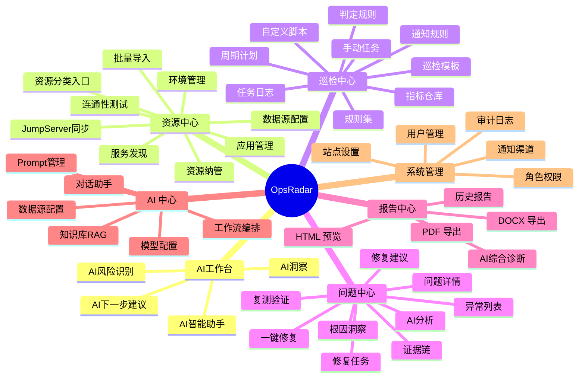

### 3.2 登录认证模块

认证模块负责用户登录、Token 签发和登录态校验。

设计要点：

| 设计点 | 说明 |
| --- | --- |
| 登录接口 | 用户通过 `/api/auth/login` 提交用户名和密码 |
| 密码存储 | 使用安全哈希算法生成密码哈希，数据库不保存明文密码 |
| 身份令牌 | 登录成功后签发 JWT，前端保存到 `localStorage` |
| 接口鉴权 | 后续请求通过 `Authorization: Bearer <token>` 访问受保护接口 |
| 审计记录 | 登录成功、登录失败均写入审计日志 |
| 失效处理 | Token 无效或过期时返回 `401`，前端回到登录页 |

### 3.3 RBAC 权限模块

系统使用角色权限模型控制不同用户可访问的功能。

核心对象：

| 对象 | 说明 |
| --- | --- |
| User | 用户账号，绑定角色 |
| Role | 角色定义，包含权限列表 |
| Permission | 权限点，如 `resources:create`、`tasks:read`、`reports:export` |

权限匹配方式：

| 类型 | 示例 | 含义 |
| --- | --- | --- |
| 精确权限 | `resources:create` | 允许创建资源 |
| 模块通配 | `resources:*` | 允许资源模块所有操作 |
| 超级权限 | `*` | 拥有平台全部权限 |

内置角色：

| 角色 | 定位 |
| --- | --- |
| admin | 系统管理员，拥有全部权限 |
| operator | 运维操作员，负责资源、巡检、报告和问题处理 |
| user | 普通用户，只读查看概览、资源、任务、问题和报告 |

### 3.4 应用环境与资源中心

资源中心用于表达“业务系统运行在哪里、由哪些资源组成、每个资源承担什么角色”。资源页参考设计图，默认展示资源分类卡片，同时提供全部资源、最近巡检、收藏视图、搜索、筛选和列表/卡片视图切换。

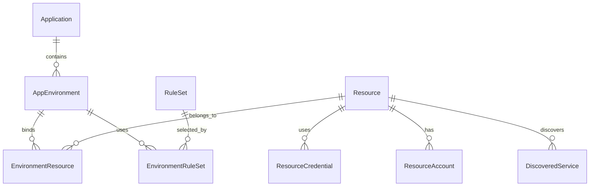

核心设计：

| 对象 | 说明 |
| --- | --- |
| Application | 业务应用，如 JumpServer、ITDevOps |
| AppEnvironment | 应用环境，如生产环境、预发环境、测试环境 |
| Resource | 被纳管资源，如主机、数据库、Redis、容器、Compose 服务 |
| EnvironmentResource | 环境与资源的绑定关系，记录层级、角色和权重 |
| ResourceCredential | 资源连接凭据，保存账号、认证方式、密钥引用和加密后的敏感字段 |
| ResourceAccount | 一个资源可绑定多个账号，如只读巡检账号、修复账号、数据库账号 |
| DiscoveredService | 从主机中发现的服务，如容器、端口、Systemd 单元、进程 |

资源支持类型：

| 类型 | 说明 |
| --- | --- |
| host / linux / server | Linux/Unix 主机，使用 SSH 执行 shell 巡检 |
| mysql | MySQL 数据库资源 |
| pgsql / postgresql | PostgreSQL 数据库资源 |
| redis | Redis 缓存资源 |
| container | Docker 容器服务，通过宿主机 SSH 执行 Docker 命令 |
| compose | Docker Compose 服务，通过宿主机 SSH 执行 Compose 命令 |
| systemd | Systemd 服务，通过宿主机 SSH 执行 systemctl/journalctl |
| kubernetes | Kubernetes 集群资源，v1 可先保存 kubeconfig 或 API 连接配置，执行能力后续扩展 |
| prometheus | Prometheus 数据源，用于指标查询和 AI 证据链 |
| victoriametrics | VictoriaMetrics 数据源，用于指标查询和趋势分析 |
| victorialogs | VictoriaLogs 日志源，用于日志检索和异常证据 |
| grafana | Grafana 看板源，用于面板链接、查询上下文和报告引用 |

资源核心字段：

| 字段 | 说明 |
| --- | --- |
| name | 资源名称，支持从 JumpServer 或导入文件同步 |
| resource_type | 资源类型，如 host、mysql、redis、prometheus |
| ip / host | 连接地址，主机通常为 IP，数据源可为域名或 URL |
| port | 连接端口 |
| protocol | ssh、mysql、postgresql、redis、http、https、api |
| region / zone | 区域和机房 |
| tags | 标签，如 prod、db、middleware、core |
| owner | 负责人或团队 |
| status | unknown、online、offline、warning、disabled |
| source | manual、import、jumpserver、api |
| last_check_at | 最近连通性测试时间 |
| last_inspection_at | 最近巡检时间 |
| extra_params | 类型相关扩展配置，敏感字段必须加密或引用凭据表 |

资源录入方式：

| 方式 | 说明 | v1 验收标准 |
| --- | --- | --- |
| 手工创建 | 表单录入单个资源 | 可创建主机、数据库、Redis、监控/日志数据源 |
| 批量导入 | CSV / Excel 导入服务器和账号信息 | 支持字段映射、预校验、重复策略、导入结果明细 |
| JumpServer 同步 | 通过 JumpServer API 同步资产、账号、连接方式、IP、名称、标签 | 支持手动同步、按标签/节点过滤、同步日志和失败原因 |
| API 接入 | 外部系统调用资源 API 写入 | 支持鉴权、幂等键和审计 |

批量导入字段建议：

| 字段 | 必填 | 说明 |
| --- | --- | --- |
| name | 是 | 资源名称 |
| resource_type | 是 | host、mysql、redis 等 |
| ip | 是 | 连接 IP 或主机名 |
| port | 否 | 默认按类型填充，如 SSH 22、MySQL 3306 |
| username | 否 | 连接账号 |
| auth_type | 否 | password、private_key、jumpserver_ref |
| password | 否 | 导入后立即加密，不在响应中返回 |
| private_key | 否 | 导入后立即加密，不在响应中返回 |
| tags | 否 | 逗号分隔标签 |
| environment | 否 | 可直接绑定到应用环境，如 devops-prod |
| role | 否 | 在环境中的角色，如 app、db、cache、middleware |

应用环境设计：

| 对象 | 示例 | 说明 |
| --- | --- | --- |
| Application | devops | 一个业务应用或系统 |
| AppEnvironment | devops-prod | 应用的生产环境，也可以是 dev、test、staging |
| EnvironmentResource | devops-prod 绑定 3 台主机、1 个 MySQL、1 个 Redis、Prometheus 数据源 | 表达一个集群环境的实际组成 |
| ResourceRole | app、db、cache、mq、gateway、monitor、log | 表达资源在环境中的作用 |

环境页面需要支持：

- 创建应用和环境。
- 向环境绑定资源，支持按资源类型、标签、导入批次、JumpServer 节点筛选。
- 为绑定关系设置角色、权重、是否关键资源。
- 环境详情展示资源清单、最近巡检、问题数量、健康评分和报告入口。
- 环境可绑定默认规则集，创建巡检任务时自动带出。

资源凭据安全策略：

| 策略 | 说明 |
| --- | --- |
| 加密保存 | 密码或私钥使用 AES-GCM 加密后保存在 `extra_params` |
| 接口隐藏 | API 响应不返回明文或密文凭据 |
| 运行解密 | worker 执行任务时仅在内存中解密凭据 |
| 输出脱敏 | 巡检输出经过敏感信息脱敏后再落库 |

资源页列表字段建议：

| 字段 | 说明 |
| --- | --- |
| 名称 / IP | 主展示字段，支持复制 |
| 类型 | 主机、数据库、中间件、日志源、监控源等 |
| 连接状态 | online、offline、unknown |
| 所属环境 | 一个资源可属于多个环境 |
| 标签 | 用于筛选和规则匹配 |
| 最近巡检 | 最近任务时间和结果 |
| 问题数 | 当前未关闭问题数量 |
| 操作 | 查看、编辑、测试连接、服务发现、加入环境、发起巡检 |

### 3.5 指标仓库、巡检模板与规则集

指标仓库是巡检能力标准化的核心。每个指标定义“检查什么”，每个巡检模板定义“对什么类型资源、执行什么命令、如何判断结果”，规则集用于把多个指标组合成一次可复用的巡检方案。

内置指标分类：

| 分类 | 示例指标 | 适用资源 |
| --- | --- | --- |
| OS 基础 | CPU 使用率、内存使用率、磁盘使用率、inode、系统负载、进程数、登录失败次数 | host |
| OS 安全 | SSH 配置、弱口令风险、sudo 配置、账号过期、关键文件权限 | host |
| Docker | Docker 服务状态、容器运行状态、镜像磁盘占用、异常重启容器 | host、container |
| Kubernetes | Node 状态、Pod 异常、Deployment 副本、事件异常、证书过期 | kubernetes |
| MySQL | 连接数、慢查询、主从状态、锁等待、表空间、版本风险 | mysql |
| PostgreSQL | 连接数、长事务、复制延迟、膨胀表、锁等待、数据库大小 | postgresql |
| Redis | 内存使用、连接数、慢日志、持久化状态、主从复制 | redis |
| 中间件 | Nginx、Kafka、RabbitMQ、Nacos、Elasticsearch 等服务状态和关键指标 | middleware |
| CIS 基线 | 密码策略、审计配置、内核参数、服务暴露、安全加固项 | host |
| 监控指标 | Prometheus / VictoriaMetrics 查询结果阈值判断 | prometheus、victoriametrics |
| 日志指标 | VictoriaLogs 查询异常关键字、错误量趋势 | victorialogs |

巡检模板字段：

| 字段 | 说明 |
| --- | --- |
| name | 巡检项名称 |
| category | 分类，如 os、security、mysql、postgresql、redis、container |
| resource_type | 适用资源类型 |
| command_type | 命令类型，如 shell、sql、redis |
| command_template | 命令模板，支持变量替换 |
| expected_result_pattern | 结果判定规则 |
| severity | 异常严重级别：info、low、medium、high、critical |
| timeout_seconds | 单项执行超时时间 |
| variables | 变量定义，如阈值、路径、服务名、数据库名 |
| evidence_extract | 证据提取配置，用于从输出中抽取关键值 |
| suggestion_template | 默认修复建议模板 |
| repair_template_id | 可选，关联一键修复模板 |
| is_builtin | 是否内置模板 |
| enabled | 是否启用 |

自定义巡检脚本：

| 脚本类型 | 说明 | 判定方式 |
| --- | --- | --- |
| shell | 在主机或容器宿主机执行 shell 命令 | exit_code、regex、threshold、json_path |
| sql | 在 MySQL / PostgreSQL 等数据库执行查询 | 行数、字段值、阈值、正则 |
| redis | 执行 Redis INFO / CONFIG / 自定义命令 | key-value 阈值、文本匹配 |
| http | 调用 HTTP API 或健康检查接口 | 状态码、响应时间、JSONPath |
| promql | 查询 Prometheus / VictoriaMetrics | 时序值阈值、持续时间 |
| logql / logs | 查询 VictoriaLogs 等日志源 | 匹配数量、关键字、时间窗口 |

判定规则设计：

| 规则类型 | 示例 | 说明 |
| --- | --- | --- |
| 无规则 | 空字符串 | 命令返回码为 0 即成功 |
| 人工查看 | `manual` / `review` | 结果仅记录，不作为失败判断 |
| 空输出 | `empty` | 期望命令没有输出 |
| 正则匹配 | `regex:active` | 输出匹配正则即成功 |
| 阈值判断 | `< 80`、`<= 90` | 从输出中提取数字或百分比进行阈值判断 |
| 文本包含 | `running` | 输出包含指定文本即成功 |
| JSONPath | `jsonpath:$.status == "ok"` | 对 JSON 输出做字段判断 |
| 行数判断 | `rows == 0` | SQL 查询结果行数符合预期 |
| 时间窗口 | `count(error, 5m) < 10` | 日志或指标在时间窗口内满足阈值 |
| 复合条件 | `cpu < 80 && mem < 85` | 多个判定条件同时成立 |

规则集用于将多个巡检项按资源类型、服务类型或条件组合，方便环境级巡检任务快速选取。

规则集字段：

| 字段 | 说明 |
| --- | --- |
| name | 规则集名称，如 Linux 基础巡检、MySQL 深度巡检、CIS Level 1 |
| scope_type | 适用范围：resource_type、environment、application、manual |
| items | 包含的指标列表和执行顺序 |
| default_enabled | 创建任务时是否默认选中 |
| risk_level | 整体风险级别 |
| version | 规则集版本 |
| is_builtin | 是否内置 |
| enabled | 是否启用 |

规则集编辑要求：

- 支持从指标仓库按分类、资源类型、严重级别筛选指标。
- 支持复制内置规则集后自定义，内置规则集不直接修改。
- 支持启停单个指标。
- 支持为指标覆盖阈值变量，例如磁盘使用率从 80% 调整到 90%。
- 支持预览最终执行清单：资源类型、命令、判定规则、超时、风险等级。

### 3.6 巡检任务模块

巡检任务分为两类：

| 类型 | 说明 |
| --- | --- |
| 一次性任务 | 用户选择巡检范围、执行配置、通知规则、巡检指标后立即或定时执行一次 |
| 周期任务 | 用户配置 cron / 固定间隔 / 每日每周时间，由调度器周期创建真实任务 |

任务创建表单需要包含：

| 配置项 | 说明 |
| --- | --- |
| 任务名称 | 默认按环境和时间生成，允许用户修改 |
| 巡检范围 | 应用环境、资源分组、资源标签、具体资源、最近导入批次 |
| 资源类型 | 主机、数据库、中间件、Kubernetes、日志源、监控源等 |
| 指标选择 | 选择规则集，也可在规则集中二次增删指标 |
| 执行账号 | 默认使用资源绑定的巡检账号，必要时可选择修复账号或只读账号 |
| 并发配置 | 任务级并发、单资源并发、失败是否继续 |
| 超时配置 | 单项超时、单资源超时、整任务超时 |
| 执行方式 | 立即执行、指定时间执行、周期执行 |
| 通知规则 | 任务开始、任务完成、发现高危问题、执行失败时通知 |
| 报告生成 | 是否自动生成 HTML、DOCX、PDF |
| AI 分析 | 是否生成 AI 综合诊断、根因分析、证据链和修复建议 |

巡检范围解析规则：

- 选择应用环境时，默认读取环境绑定的所有启用资源。
- 选择资源标签时，按标签动态匹配资源，任务执行前固化资源快照。
- 选择规则集时，只对规则集适用资源类型生成巡检项。
- 手动增删指标只影响当前任务，不反向修改规则集。
- 周期任务每次执行时重新解析动态范围，但真实任务必须保存当次资源和指标快照。

任务状态机：

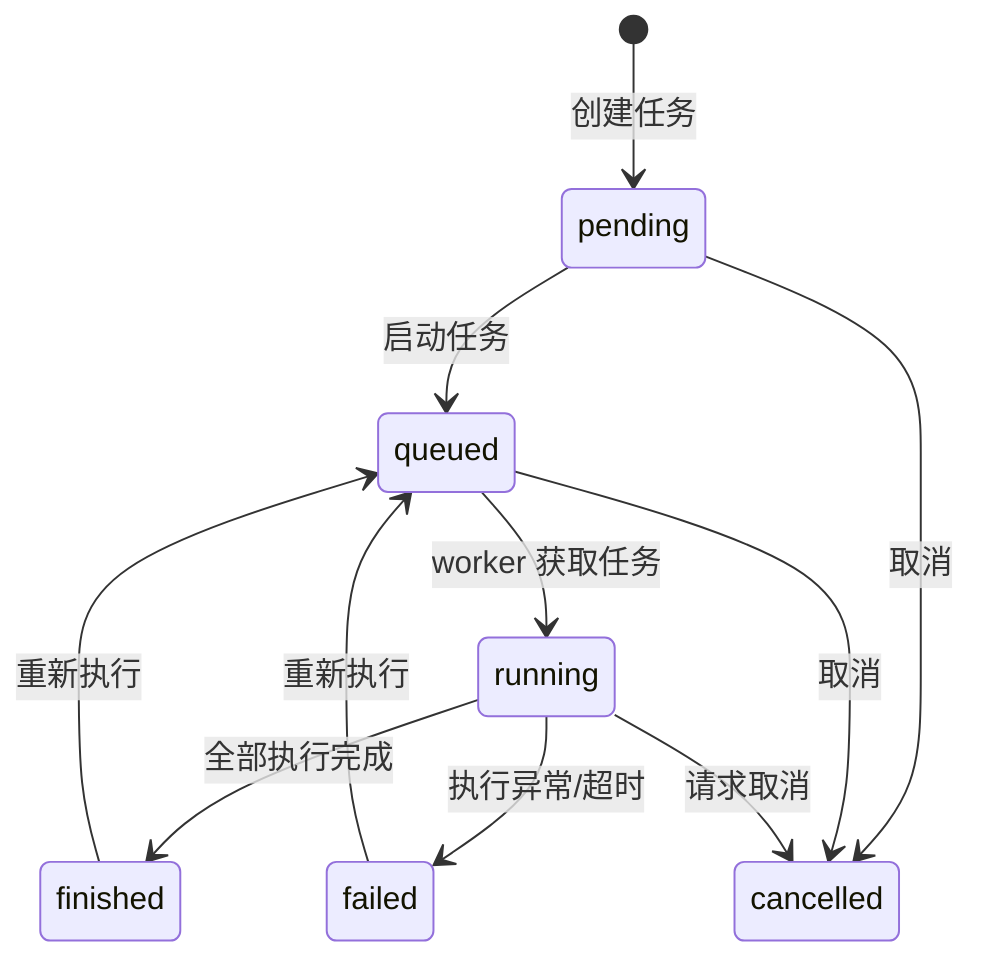

任务结果设计：

| 数据 | 说明 |
| --- | --- |
| Task | 巡检任务主记录，保存状态、应用环境、汇总统计、报告路径 |
| TaskResult | 每个资源和巡检项的执行结果 |
| TaskLog | 任务运行日志 |
| Issue | 失败或异常结果自动生成的问题 |
| InspectionReport | 巡检报告记录 |

任务主记录字段建议：

| 字段 | 说明 |
| --- | --- |
| name | 任务名称 |
| task_type | once、scheduled |
| source_type | manual、ai_assistant、cron_plan、api |
| scope_snapshot | 本次巡检范围快照 |
| rule_snapshot | 本次指标和规则快照 |
| status | pending、queued、running、finished、failed、cancelled |
| total_count / success_count / failed_count / exception_count | 汇总统计 |
| started_at / finished_at | 执行时间 |
| created_by | 创建人 |
| notification_policy | 通知策略快照 |
| report_policy | 报告生成策略快照 |

通知渠道：

| 渠道 | v1 要求 |
| --- | --- |
| 邮件 | 支持 SMTP 配置和收件人列表 |
| 企业微信 / 钉钉 / 飞书 | 支持 Webhook 方式 |
| 站内通知 | 通知中心展示和顶部通知入口 |

通知触发条件：

- 任务创建成功。
- 任务执行完成。
- 任务执行失败或超时。
- 发现 high / critical 问题。
- 修复任务完成或失败。

### 3.7 巡检执行模块

巡检执行由 `opsradar-worker-agent` 异步完成，避免长时间巡检阻塞 API 请求。Worker Agent 是 OpsRadar 的受控执行进程，主动连接 `opsradar-api`，负责接收任务、控制并发、注入凭据、采集日志、解析结果和回写状态。

Ansible Runner 不是替代 Worker 的调度中心，而是 Worker 内部的可选执行后端。Worker 在需要执行 Ansible playbook、role、module 或复杂批量修复时调用 Ansible Runner；Runner 只负责具体执行，任务权限、范围、并发、超时、日志、审计和结果沉淀仍由 OpsRadar Worker 控制。

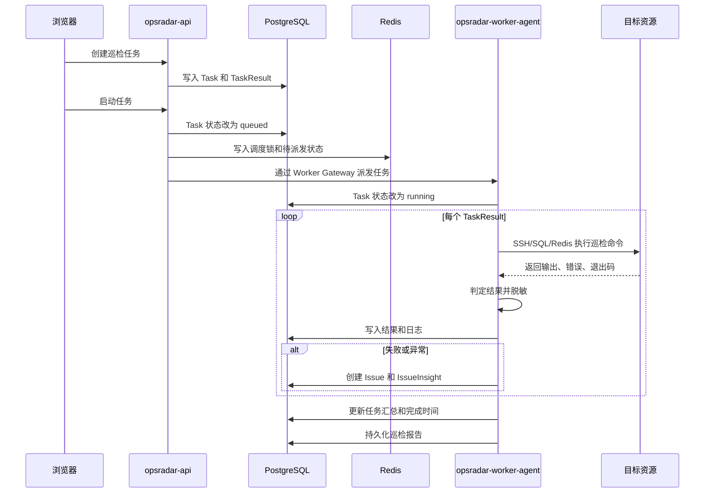

执行器设计：

| 执行器 | 适用资源 | 说明 |
| --- | --- | --- |
| ShellExecutor | host、linux、server、container、compose、systemd | 通过 Go SSH 执行 shell 命令 |
| PostgresExecutor | pgsql、postgresql | 通过 SQL Executor 执行 PostgreSQL 巡检查询 |
| MySQLExecutor | mysql | 通过 SQL Executor 执行 MySQL 巡检查询 |
| RedisExecutor | redis | 通过 Redis Executor 执行 Redis INFO / CONFIG / 自定义命令 |
| HttpExecutor | http、api、grafana、prometheus、victoriametrics、victorialogs | 调用 HTTP/API 查询健康状态、指标和日志 |
| AnsibleRunnerExecutor | host、linux、server、middleware、repair_task | 调用 ansible-runner 执行 playbook、role、module 或 ad-hoc 任务 |
| JudgementEngine | 所有执行器 | 统一判定输出是否成功、失败或异常 |

执行器选择策略：

| 场景 | 默认执行器 |
| --- | --- |
| SSH 执行单条命令 | ShellExecutor |
| SQL 查询巡检 | PostgresExecutor / MySQLExecutor |
| Redis 命令巡检 | RedisExecutor |
| HTTP/API 健康检查 | HttpExecutor |
| Prometheus / VictoriaMetrics 指标查询 | HttpExecutor |
| VictoriaLogs 日志查询 | HttpExecutor |
| 简单 OS 指标巡检 | ShellExecutor |
| 已有 Ansible playbook / role | AnsibleRunnerExecutor |
| 多步骤批量修复 | AnsibleRunnerExecutor |
| 需要 facts、inventory、vars、collections 的复杂任务 | AnsibleRunnerExecutor |

Ansible Runner 执行要求：

- Worker 为每次任务生成临时 `private_data_dir`，其中包含本次任务允许访问的 inventory、env、project、artifacts。
- inventory 只包含本次巡检或修复范围内的资源，不允许使用全量资产清单。
- 凭据由 Worker 解密后临时注入，任务结束后清理临时文件。
- Runner 事件流必须转换为 `task_log`、`task_result`、`issue_evidence` 和审计记录。
- Worker 必须控制 Runner 的并发、超时、取消和返回码解析。
- Ansible 输出进入数据库和报告前必须脱敏。

### 3.8 问题中心与根因洞察

当巡检结果为 `fail` 或 `exception` 时，worker 自动生成问题记录，并根据分析规则生成 IssueInsight。

问题闭环流程：


问题状态：

```text
open
  -> confirmed
  -> fixing
  -> retesting
  -> fixed
  -> closed

open
  -> ignored
```

问题列表字段：

| 字段 | 说明 |
| --- | --- |
| 标题 | 默认由资源、指标和异常摘要生成，可人工修改 |
| 严重级别 | info、low、medium、high、critical |
| 状态 | open、confirmed、fixing、retesting、fixed、closed、ignored |
| 所属环境 | 问题关联的应用环境 |
| 资源 | 问题发生的资源 |
| 指标 | 触发问题的巡检指标 |
| 首次发现 / 最近发现 | 用于判断是否反复出现 |
| 负责人 | 当前处理人 |
| AI 状态 | 未分析、分析中、已分析、分析失败 |

IssueInsight 包含：

| 字段 | 说明 |
| --- | --- |
| probable_cause | 可能原因 |
| impact | 影响范围 |
| recommendation | 建议处理动作 |
| steps | 人工执行步骤 |
| verification | 修复后验证方式 |
| risk_level | 风险等级 |

问题详情需要包含：

- 基本信息：问题标题、状态、严重级别、所属环境、资源、指标、负责人、创建时间。
- 异常证据：命令输出、错误输出、退出码、判定规则、提取值、日志片段、指标查询结果。
- AI 分析：综合判断、可能根因、置信度、影响范围、修复建议、回滚建议。
- 证据链：关联的巡检结果、任务日志、历史相似问题、历史报告、知识库引用、监控/日志查询。
- 处理记录：确认、指派、备注、修复任务、复测记录、关闭原因。
- 操作入口：AI 分析、生成修复建议、创建修复任务、一键修复、发起复测、忽略、关闭。

证据链结构：

| 证据类型 | 示例 |
| --- | --- |
| inspection_result | 失败的巡检项、输出、判定规则 |
| task_log | 执行日志、异常堆栈、超时记录 |
| metric_query | Prometheus / VictoriaMetrics 查询语句和结果 |
| log_query | VictoriaLogs 查询语句、时间范围、命中日志 |
| report | 历史巡检报告中的相似异常 |
| knowledge | SOP、故障复盘、厂商文档片段 |

一键修复约束：

- 一键修复本质是创建并执行 `RepairTask`，不能绕过权限和审计。
- AI 可以生成修复任务草稿，但必须由用户确认。
- 高风险修复必须进入审批或二次确认。
- 修复命令执行前必须展示参数预览和影响范围。
- 修复完成后自动触发复测，复测通过后才允许将问题标记为 fixed / closed。

### 3.9 报告中心

报告模块将巡检结果、异常证据、健康概览和处理建议整合成可归档文件。

支持格式：

| 格式 | 用途 |
| --- | --- |
| HTML | 在线预览 |
| DOCX | 离线编辑、提交报告 |
| PDF | 固化归档、正式交付 |

报告内容：

| 模块 | 说明 |
| --- | --- |
| 巡检概况 | 总检查项、成功数、失败数、异常数 |
| 环境信息 | 应用、环境、健康评分和资源分层 |
| AI 综合诊断 | 用自然语言总结环境健康状况、主要风险、趋势和优先处理建议 |
| 结果明细 | 每个资源、每个巡检项的执行状态和输出 |
| 异常分析 | 当前状态、判定规则、风险等级、AI 根因分析、证据链、建议处理 |
| 处理步骤 | 针对异常的人工修复步骤和验证方式 |

报告生成要求：

- 任务完成后可按策略自动生成 HTML 报告。
- DOCX 和 PDF 可以自动生成，也可以由用户手动触发。
- 报告必须基于任务快照生成，不能因为资源或规则后续修改导致历史报告变化。
- 报告中敏感字段必须脱敏。
- 报告详情页提供预览、下载、重新生成、复制链接和关联问题列表。
- AI 综合诊断与原始巡检结果分开存储，允许更换模型或 Prompt 后重新生成 AI 诊断。

报告列表字段：

| 字段 | 说明 |
| --- | --- |
| 报告名称 | 默认由任务名称生成 |
| 所属环境 | 应用和环境 |
| 巡检时间 | 任务开始和结束时间 |
| 健康评分 | 按成功率、严重级别和关键资源权重计算 |
| 问题统计 | high / critical / open 问题数量 |
| 格式 | HTML、DOCX、PDF 是否已生成 |
| AI 诊断 | 未生成、生成中、已生成、失败 |

### 3.10 AI 工作流模块

AI 助手不是自由聊天机器人，而是平台工作流编排器和智能诊断入口。它根据用户自然语言识别意图，创建持久化 workflow，并通过平台 action 推进流程；在巡检报告和问题详情中，AI 负责上下文组装、RAG 检索、根因分析、证据链归纳和修复建议生成。

AI 工作流原则：

| 原则 | 说明 |
| --- | --- |
| 数据真实 | 不编造资产、任务、报告、问题或修复结果 |
| 状态持久 | workflow 状态存储在 PostgreSQL |
| 动作可控 | 涉及创建、执行、修复、删除等动作必须确认 |
| 缺项可补 | 环境、资产、规则缺失时引导用户补齐，补齐后继续流程 |
| 权限受控 | 每个 AI action 仍然经过 RBAC 权限判断 |
| 证据可追溯 | AI 结论必须尽量给出引用来源，包括巡检结果、日志、指标、报告和知识库 |

AI 能力中心：

| 能力 | v1 功能 |
| --- | --- |
| 模型配置 | OpenAI-compatible Provider，配置 endpoint、model、api_key、timeout、temperature、启停状态 |
| 对话助手 | 首页 AI 智能巡检助手，支持流式 SSE；需要双向交互时可扩展 WebSocket |
| 数据源配置 | JDBC、API、文件、日志源、Prometheus、VictoriaMetrics、VictoriaLogs、Grafana |
| 知识库 / RAG | 文档上传、分片、embedding、检索、引用展示，v1 可用 PostgreSQL + pgvector |
| Prompt 管理 | Prompt 存数据库，按场景版本化，支持变量模板、启停和回滚 |
| 智能诊断 | 巡检报告综合诊断、问题根因分析、证据链、修复建议 |
| 工作流编排 | LiteFlow 或内部 action registry 起步，复杂审批后再扩展 Flowable |

AI Orchestrator 处理链路：

```text
用户问题 / 巡检异常 / 报告生成
  -> 识别意图和业务对象
  -> 组装上下文：环境、资源、任务、结果、问题、报告
  -> RAG 检索：知识库、历史报告、历史问题、任务日志
  -> 数据源查询：Prometheus、VictoriaMetrics、VictoriaLogs、Grafana 链接
  -> 调用 LLM
  -> 输出结构化结果：诊断、根因、证据链、修复建议、下一步动作
  -> 用户确认后执行平台 action
```

工作流主链路：

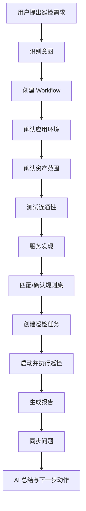

典型意图：

| 意图 | 说明 |
| --- | --- |
| create_and_run_inspection | 创建并执行巡检 |
| add_asset | 添加资产 |
| discover_services | 服务发现 |
| analyze_issue | 异常分析和根因定位 |
| generate_repair_suggestion | 生成修复建议 |
| create_repair_task | 创建修复任务 |
| query_platform_summary | 查询平台概况 |
| query_issues | 查询问题列表 |

AI Action 范围：

| Action | 是否需要确认 | 说明 |
| --- | --- | --- |
| search_resources | 否 | 查询资源、环境、标签 |
| summarize_dashboard | 否 | 汇总首页概览 |
| create_inspection_draft | 否 | 生成巡检任务草稿 |
| create_inspection_task | 是 | 创建真实巡检任务 |
| start_inspection_task | 是 | 启动巡检任务 |
| analyze_issue | 否 | 分析已有问题 |
| generate_report_diagnosis | 否 | 为报告生成 AI 诊断 |
| create_repair_task_draft | 否 | 生成修复任务草稿 |
| create_repair_task | 是 | 创建修复任务 |
| execute_repair_task | 是，高风险需审批 | 执行修复任务 |
| retest_issue | 是 | 发起复测 |

AI 输出结构化要求：

| 场景 | 输出字段 |
| --- | --- |
| 首页问答 | answer、related_resources、related_tasks、suggested_actions |
| 巡检任务创建 | scope、rule_set、schedule、notification_policy、missing_fields、confirm_text |
| 巡检报告诊断 | summary、health_score_reason、top_risks、root_causes、recommendations、citations |
| 问题根因分析 | probable_causes、confidence、evidence_chain、impact、repair_suggestion、verification_steps |
| 修复建议 | risk_level、pre_checks、steps、rollback_steps、retest_plan、requires_approval |

## 4. 数据库设计

### 4.1 数据域划分

| 数据域 | 主要表 |
| --- | --- |
| 用户权限域 | `users`、`roles` |
| 资源环境域 | `applications`、`app_environments`、`resources`、`resource_credentials`、`resource_accounts`、`environment_resources`、`resource_types`、`discovered_services`、`resource_import_batches`、`jumpserver_sync_jobs` |
| 巡检配置域 | `inspection_metrics`、`inspection_items`、`rule_sets`、`rule_set_items`、`environment_rule_sets`、`custom_scripts`、`judgement_rules`、`cron_plans` |
| 任务执行域 | `inspection_tasks`、`task_results`、`task_logs` |
| 问题闭环域 | `issues`、`issue_insights`、`issue_evidences`、`analysis_rules`、`repair_tasks`、`repair_task_steps`、`retest_tasks` |
| 报告域 | `inspection_reports`、`report_ai_diagnoses`、`report_exports` |
| AI 域 | `ai_model_providers`、`ai_model_configs`、`ai_assistant_settings`、`ai_chat_sessions`、`ai_chat_messages`、`ai_workflows`、`ai_workflow_events`、`ai_analysis_jobs`、`ai_analysis_results`、`prompt_templates` |
| 知识库域 | `knowledge_spaces`、`knowledge_documents`、`knowledge_chunks`、`knowledge_embeddings`、`knowledge_citations` |
| 可观测域 | `observability_datasources`、`environment_datasource_bindings`、`observation_query_results`、`grafana_panels` |
| 系统管理域 | `site_settings`、`audit_logs`、`notification_channels`、`notification_events` |

### 4.2 核心实体关系

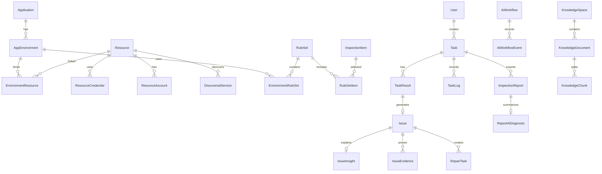

### 4.3 快照设计

巡检结果中保存资源快照和巡检项快照，而不是只保存外键。

设计原因：

| 原因 | 说明 |
| --- | --- |
| 保证历史可追溯 | 即使资源名称、IP、模板命令后续修改，历史报告仍能还原当时状态 |
| 避免凭据泄露 | 快照只保存非敏感字段，不保存密码或密钥 |
| 便于报告导出 | 报告可以直接基于快照生成，不受当前资源配置变化影响 |
| 便于问题分析 | Issue 证据中包含当时输出、错误、资源信息和判定规则 |

必须保存快照的对象：

| 快照 | 保存位置 | 内容 |
| --- | --- | --- |
| resource_snapshot | `task_results`、`issues` | 名称、类型、IP、端口、标签、环境角色，不含凭据 |
| item_snapshot | `task_results` | 指标名称、命令模板、变量、判定规则、严重级别 |
| scope_snapshot | `inspection_tasks` | 任务创建时解析出的资源范围 |
| rule_snapshot | `inspection_tasks` | 本次任务使用的规则集、指标和阈值 |
| evidence_snapshot | `issue_evidences` | 输出、日志、指标查询结果、知识库引用 |
| ai_context_snapshot | `ai_analysis_jobs` | AI 分析时使用的上下文摘要和引用，不保存敏感明文 |

## 5. 核心业务流程

### 5.1 资产纳管流程

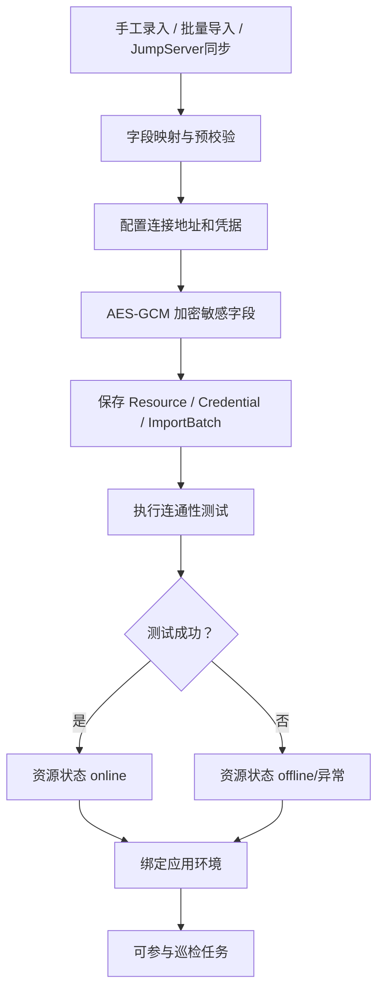

### 5.1.1 JumpServer 同步流程

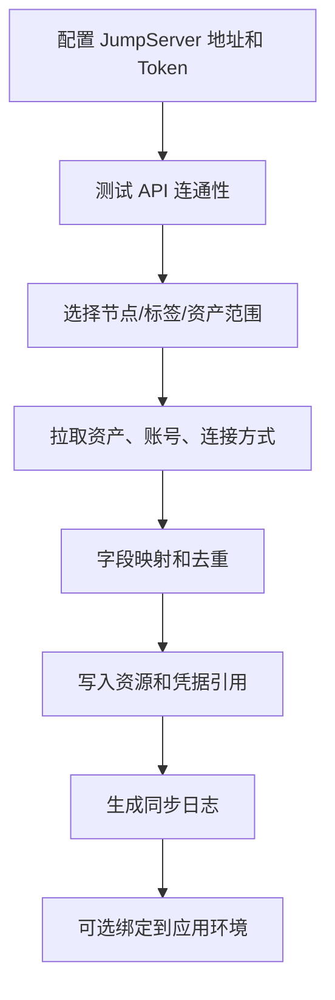

同步策略：

- 以 JumpServer asset id 作为外部来源 ID，保证重复同步可幂等更新。
- 凭据优先保存引用关系；如必须落库，必须加密保存。
- 资源被 JumpServer 删除时，OpsRadar 默认标记为 disabled，不自动物理删除。
- 同步失败要记录失败资产、失败字段和错误原因。

### 5.2 应用环境巡检流程

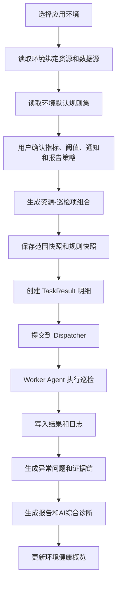

### 5.3 周期巡检流程

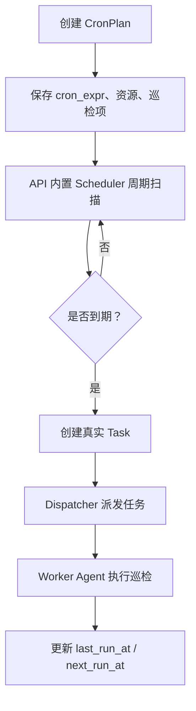

### 5.4 报告生成流程

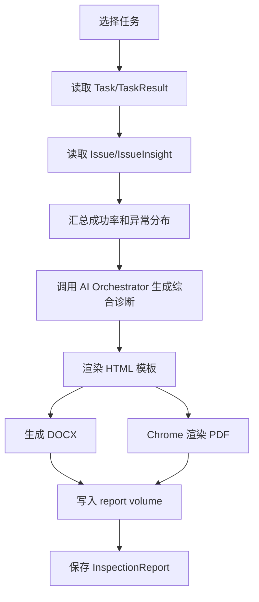

### 5.5 问题修复与复测流程

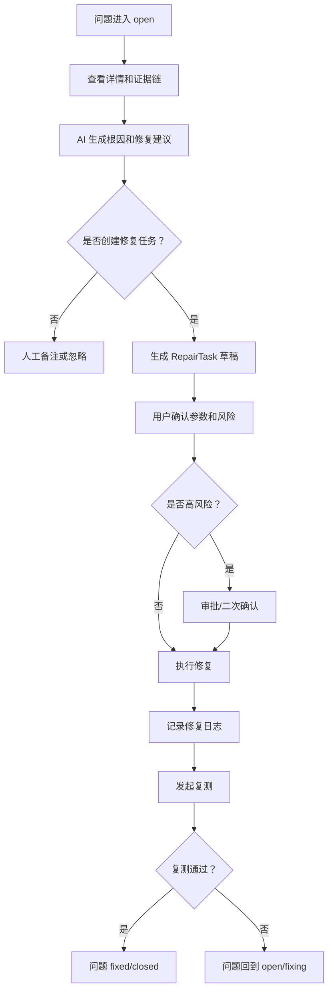

## 6. 接口设计

### 6.1 API 设计原则

| 原则 | 说明 |
| --- | --- |
| REST 风格 | 资源使用名词路径，操作使用 HTTP method 表达 |
| 统一鉴权 | 受保护接口统一依赖 JWT 用户解析 |
| 权限前置 | 写操作和敏感读操作执行前检查 RBAC 权限 |
| 敏感字段过滤 | 资源凭据、AI 密钥等敏感信息不直接返回前端 |
| 错误语义明确 | 未登录返回 `401`，无权限返回 `403`，参数错误返回 `422` |

### 6.2 主要接口分组

| 分组 | 示例路径 | 说明 |
| --- | --- | --- |
| 认证与用户 | `/api/auth/login`、`/api/me` | 登录、当前用户信息 |
| AI 工作台 | `/api/dashboard/ai-workbench`、`/api/ai/chat`、`/api/ai/actions` | AI 会话、AI 洞察、风险识别、下一步建议 |
| 应用环境 | `/api/applications`、`/api/environments` | 应用和环境增删改查 |
| 资源中心 | `/api/resources`、`/api/resources/import`、`/api/resources/{id}/test`、`/api/resources/{id}/discover-services` | 资源纳管、批量导入、连通性测试、服务发现 |
| JumpServer | `/api/integrations/jumpserver/config`、`/api/integrations/jumpserver/sync-jobs` | JumpServer 配置、测试连接、同步任务 |
| 数据源 | `/api/datasources`、`/api/datasources/{id}/test`、`/api/datasources/{id}/query` | Prometheus、VictoriaMetrics、VictoriaLogs、Grafana、JDBC/API 数据源 |
| 巡检配置 | `/api/inspection-metrics`、`/api/inspection-items`、`/api/rule-sets`、`/api/custom-scripts` | 指标仓库、巡检模板、规则集、自定义脚本 |
| 任务中心 | `/api/tasks`、`/api/tasks/{id}/start`、`/api/tasks/{id}/cancel`、`/api/tasks/{id}/rerun`、`/api/tasks/manual` | 创建、启动、取消、重跑巡检任务 |
| 周期计划 | `/api/cron-plans`、`/api/cron-plans/{id}` | 创建、更新、启停和删除周期计划 |
| 问题中心 | `/api/issues`、`/api/issues/{id}`、`/api/issues/{id}/insight`、`/api/issues/{id}/evidences`、`/api/issues/{id}/retest` | 异常处理、洞察、证据链、复测 |
| 修复任务 | `/api/repair-tasks`、`/api/repair-tasks/{id}/confirm`、`/api/repair-tasks/{id}/execute` | 修复任务草稿、确认、执行和日志 |
| 报告中心 | `/api/reports`、`/api/reports/{task_id}`、`/api/reports/{task_id}/preview`、`/api/reports/{task_id}/ai-diagnosis` | 报告列表、下载、预览和 AI 诊断 |
| AI 中心 | `/api/ai/providers`、`/api/ai/models`、`/api/ai/chat`、`/api/ai/workflows`、`/api/ai/actions`、`/api/ai/prompts` | AI 配置、对话、工作流、动作和 Prompt |
| 知识库 | `/api/knowledge/spaces`、`/api/knowledge/documents`、`/api/knowledge/search` | RAG 知识库空间、文档、检索 |
| 通知 | `/api/notification-channels`、`/api/notification-events` | 通知渠道和通知事件 |
| 系统管理 | `/api/users`、`/api/roles`、`/api/settings/site` | 用户、角色、站点设置 |

### 6.3 页面级验收接口

| 页面 | 首屏必须可由接口支撑 |
| --- | --- |
| 首页 | 当前用户、AI 会话、快捷动作、AI 洞察摘要、AI 风险识别、AI 下一步建议 |
| 资源页 | 资源分类统计、全部资源列表、最近巡检、收藏视图、搜索筛选、导入任务状态 |
| 任务页 | 任务列表、状态筛选、任务详情、实时日志、启动/取消/重跑操作 |
| 问题页 | 问题列表、详情、证据链、AI 分析结果、修复任务、复测记录 |
| 报告页 | 报告列表、HTML 预览、DOCX/PDF 下载、AI 综合诊断 |

## 7. 安全设计

### 7.1 身份认证安全

| 措施 | 说明 |
| --- | --- |
| JWT 鉴权 | 登录后签发 token，接口统一校验 |
| 密码哈希 | 数据库只保存密码哈希 |
| 用户状态 | 用户可禁用，禁用后无法访问系统 |
| 登录审计 | 成功和失败登录均记录 |

### 7.2 权限控制安全

| 措施 | 说明 |
| --- | --- |
| RBAC | 使用角色权限模型控制功能访问 |
| 最小权限 | 普通用户默认只读 |
| 写操作审计 | 创建任务、修改资源、删除数据等关键操作记录审计 |
| AI Action 鉴权 | AI 触发的平台动作也必须经过权限检查 |

### 7.3 凭据和敏感数据安全

| 措施 | 说明 |
| --- | --- |
| AES-GCM 加密 | 资源密码、私钥等敏感凭据加密保存 |
| 生产强制配置密钥 | `OPSRADAR_ENCRYPTION_KEY` 在生产环境必须配置 |
| API 不返凭据 | 前端只能看到 `credential_configured` 等状态字段 |
| 内存解密 | 只有 worker 执行任务时在内存中解密 |
| 输出脱敏 | 巡检输出和错误信息落库前进行敏感信息屏蔽 |
| 集成密钥保护 | JumpServer Token、Grafana Token、数据源 Token、AI API Key 必须加密保存 |
| AI 上下文脱敏 | 进入 Prompt 的资源信息、日志、指标结果必须经过敏感字段过滤 |
| 报告脱敏 | HTML/DOCX/PDF 报告不得出现密码、私钥、Token、完整连接串 |

敏感字段范围：

- password、private_key、api_key、token、secret、access_key、connection_string。
- 日志中的 Authorization、Cookie、Set-Cookie、数据库密码、云厂商密钥。
- 巡检命令输出中的 `/etc/shadow`、私钥内容、证书私钥等高敏感内容。

### 7.4 部署安全

| 措施 | 说明 |
| --- | --- |
| HTTPS | Nginx 负责 TLS 终止 |
| HTTP 跳转 HTTPS | 避免明文访问 |
| 安全响应头 | Nginx 添加基础安全 header |
| CORS 配置 | 通过环境变量限制允许访问的浏览器来源 |
| 数据备份 | PostgreSQL 和报告卷需要纳入备份策略 |

## 8. 部署设计

### 8.1 生产部署拓扑

生产环境可使用 Docker Compose 起步，核心服务如下：

| 服务 | 作用 |
| --- | --- |
| nginx | 对外入口、TLS 终止、反向代理 |
| opsradar-web | Vue 前端静态资源 |
| opsradar-api | Go 控制面，提供 REST API、认证授权、Scheduler、Dispatcher、Worker Gateway、AI Orchestrator |
| opsradar-worker-agent | Worker Agent 主进程，主动连接 API，执行巡检、复测和修复任务；容器内可内置 Ansible Runner 作为可选执行后端 |
| postgres | 权威数据库 |
| redis | 分布式锁、调度协调、限流、Worker 心跳和临时状态 |

`opsradar-worker-agent` 容器建议结构：

```text
opsradar-worker-agent
  -> Worker 主程序
     -> 主动连接 API / 注册节点 / 心跳上报 / 接收任务
     -> 接收任务 / 控制并发 / 解密凭据 / 生成临时执行目录
     -> 调用 ShellExecutor / SQLExecutor / HttpExecutor / AnsibleRunnerExecutor
     -> 收集日志 / 解析结果 / 回写任务 / 生成问题和报告
  -> ansible-runner
     -> 执行 playbook / role / module / ad-hoc 命令
```

v1 可将 Ansible Runner 直接内置在 worker 镜像中，减少部署组件。后续如果存在安全隔离、资源消耗或扩容需求，再拆成独立 runner service。

### 8.2 容器启动关系

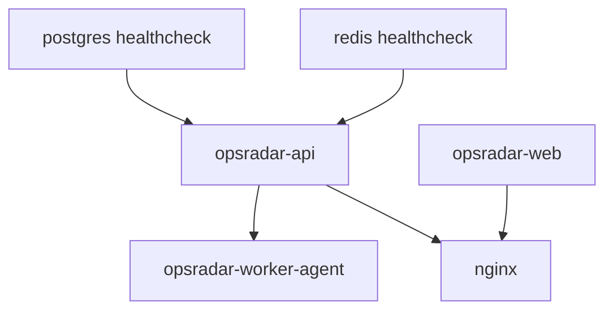

### 8.3 关键环境变量

| 环境变量 | 说明 |
| --- | --- |
| `OPSRADAR_ENV` | 运行环境，development 或 production |
| `OPSRADAR_SECRET_KEY` | JWT 签名密钥 |
| `OPSRADAR_ENCRYPTION_KEY` | 凭据加密密钥 |
| `OPSRADAR_DATABASE_URL` | PostgreSQL 连接串 |
| `OPSRADAR_REDIS_URL` | Redis 连接串 |
| `OPSRADAR_REPORT_DIR` | 报告输出目录 |
| `OPSRADAR_API_WORKERS` | API worker 数量 |
| `OPSRADAR_WORKER_CONCURRENCY` | 巡检 worker 并发数 |
| `OPSRADAR_WORKER_GATEWAY_ADDR` | Worker Gateway 监听地址 |
| `OPSRADAR_WORKER_TOKEN` | Worker Agent 接入令牌 |
| `OPSRADAR_SSH_CONNECT_TIMEOUT` | SSH 连接超时时间 |
| `OPSRADAR_SSH_COMMAND_TIMEOUT` | 命令执行超时时间 |
| `OPSRADAR_MAX_TASK_SECONDS` | 单个任务最大执行时间 |
| `OPSRADAR_CORS_ORIGINS` | 允许跨域来源 |

### 8.4 初始化流程

```bash
docker compose up -d --build
docker compose exec opsradar-api opsradar-api migrate
docker compose exec opsradar-api opsradar-api init-admin
docker compose exec opsradar-api opsradar-api check
```

初始化内容：

| 步骤 | 说明 |
| --- | --- |
| migrate | 执行数据库迁移 |
| seed-builtin | 初始化资源类型、内置角色、巡检项、分析规则等基础数据 |
| init-admin | 初始化管理员账号 |
| check | 检查数据库、Redis、配置等运行依赖 |

## 9. 非功能设计

### 9.1 可用性

| 设计 | 说明 |
| --- | --- |
| API 与 Worker 分离 | 长耗时巡检不会阻塞前端接口 |
| Worker 重试 | worker 执行失败可按配置重试 |
| 超时恢复 | worker 启动时恢复超时未完成的 running 任务 |
| 任务日志 | 每个任务保留运行日志，方便定位执行过程 |

### 9.2 可扩展性

| 扩展方向 | 当前设计支持方式 |
| --- | --- |
| 新资源类型 | 增加 ResourceType 和对应执行器 |
| 新巡检能力 | 增加 InspectionItem 模板和 command_type |
| 新判定规则 | 扩展 JudgementEngine |
| 新报告格式 | 扩展 reports 服务 |
| 新 AI 动作 | 在 AI action registry 中增加 ActionSpec 和执行函数 |
| 新 Ansible 能力 | 增加 playbook 模板、collections、roles 和 AnsibleRunnerExecutor 适配 |
| 多 worker 并发 | 增加 Worker Agent 节点或调整单节点并发参数 |

### 9.3 可维护性

| 设计 | 说明 |
| --- | --- |
| 代码分层清晰 | API、models、services、worker、core、db 分层明确 |
| 迁移脚本管理 schema | 数据库结构通过 migration 版本化 |
| 内置数据集中 seed | 资源类型、角色、分析规则等由 seed 统一初始化 |
| 服务函数复用 | 报告、加密、脱敏、RBAC、分析逻辑独立成服务模块 |

### 9.4 可观测性

| 设计 | 说明 |
| --- | --- |
| 任务日志 | 记录任务创建、启动、执行每个巡检项、失败或完成 |
| 审计日志 | 记录登录、资源变更、任务创建、任务执行等关键动作 |
| 任务状态 | pending、queued、running、finished、failed、cancelled 可视化展示 |
| 问题记录 | 将异常结果沉淀为 Issue，便于统计和跟踪 |
| 报告归档 | 每次巡检可生成报告作为历史证据 |

## 10. 项目亮点

### 10.1 应用环境视角

系统不是简单地巡检单台主机，而是以应用环境为核心，把支撑业务系统运行的 OS、数据库、中间件、网关、存储、队列和容器服务组合起来，形成面向业务系统的健康评价。

### 10.2 巡检标准沉淀

将运维经验固化为巡检模板和规则集。巡检命令、适用资源、阈值规则、异常分析和修复建议都可以沉淀为平台配置，降低对个人经验的依赖。

### 10.3 异步任务架构

巡检执行由 `opsradar-worker-agent` 完成，API 负责创建任务、周期调度、任务派发和状态控制。该设计支持长耗时巡检、并发执行、失败重试、任务取消和 Worker 横向扩展。

### 10.4 安全闭环

系统在凭据加密、接口鉴权、RBAC 权限、输出脱敏、审计日志和 HTTPS 部署方面都有完整设计，满足运维平台对安全性的基本要求。

### 10.5 AI 工作流辅助

AI 助手不是凭空回答，而是作为平台工作流编排器存在。它会识别用户意图，检查环境、资产、规则和任务状态，通过真实平台动作推进巡检流程，并在关键步骤等待用户确认。

### 10.6 报告和问题闭环

系统自动将巡检结果生成报告，并把失败或异常结果转化为问题记录，再结合分析规则生成原因、影响、建议和验证步骤，从“发现异常”延伸到“推动处理”。

## 11. 版本范围与落地优先级

### 11.1 P0 必须交付

P0 是 v1 可用闭环，必须能支撑一次真实的资源导入、环境建模、巡检执行、报告生成、问题分析和复测。

| 能力 | 验收标准 |
| --- | --- |
| 用户登录与 RBAC | admin/operator/user 三类角色可用，关键写操作有权限校验 |
| 资源纳管 | 支持手工创建主机、数据库、Redis、Prometheus、VictoriaMetrics、VictoriaLogs、Grafana 数据源 |
| 批量导入 | CSV/Excel 导入服务器，支持字段预校验、凭据加密、导入结果明细 |
| 应用环境 | 可创建应用和环境，可将资源绑定到 `devops-prod` 这类环境并设置资源角色 |
| 指标仓库 | 内置 OS、Docker、MySQL、PostgreSQL、Redis、CIS 基础指标 |
| 规则集 | 可从指标仓库创建规则集，可调整阈值和启停指标 |
| 自定义脚本 | 支持 shell、sql、redis 三类自定义巡检脚本 |
| 判定规则 | 支持 exit_code、文本包含、正则、阈值、行数判断 |
| 一次性巡检 | 可选择环境、资源、规则集、通知和报告策略创建并执行任务 |
| 周期巡检 | 可创建周期计划，由调度器生成真实任务 |
| 巡检执行 | Worker 异步执行，保存结果、日志、状态和快照 |
| Ansible Runner 后端 | Worker 可调用 ansible-runner 执行 playbook 或 module，并将事件流回写为任务日志 |
| 报告 | 任务完成后生成 HTML，支持 DOCX/PDF 导出 |
| 问题 | 失败或异常自动生成问题，问题详情可查看证据和处理记录 |
| AI 分析 | 问题详情和报告可生成 AI 综合诊断、根因分析、证据链和修复建议 |
| 修复闭环 | 可创建修复任务草稿，人工确认后执行，执行后发起复测 |
| 通知 | 支持站内通知和至少一种 Webhook 通知 |
| 审计 | 登录、资源变更、任务执行、修复执行、AI Action 记录审计 |

### 11.2 P1 增强能力

| 能力 | 说明 |
| --- | --- |
| JumpServer 同步 | 支持配置 JumpServer API，按节点/标签同步资产和账号引用 |
| 监控日志证据链 | Prometheus、VictoriaMetrics、VictoriaLogs 查询结果进入问题证据链 |
| 知识库 RAG | 支持运维文档上传、向量化、检索和引用展示 |
| Prompt 管理 | Prompt 数据库存版本，按场景启停和回滚 |
| 更多通知渠道 | 邮件、企业微信、钉钉、飞书 |
| Kubernetes 巡检 | 支持 kubeconfig/API 连接和基础对象巡检 |
| Grafana 引用 | 问题和报告中展示 Grafana 面板链接 |

### 11.3 P2 后续扩展

| 方向 | 说明 |
| --- | --- |
| 更多资源执行器 | 扩展 HTTP、SSL、Oracle、Kafka、Nacos、Elasticsearch 等巡检执行器 |
| 自动修复审批流 | 引入更完整审批流和高风险变更控制 |
| 多租户 | 支持不同团队、业务线的数据隔离 |
| 高可用部署 | API、worker、PostgreSQL、Redis 多实例或托管化部署 |
| 巡检大屏 | 增加 NOC 大屏或实时健康视图 |
| 分布式 Worker Agent | 面向跨机房、跨网段和 4w+ 服务器规模扩展 |

## 12. 研发拆分建议

### 12.1 后端迭代拆分

| 迭代 | 交付内容 | 主要产物 |
| --- | --- | --- |
| M1 资源与环境 | 资源 CRUD、凭据加密、批量导入、应用环境、资源绑定、连通性测试 | 资源表、环境表、导入批次、测试连接 API |
| M2 指标与规则 | 指标仓库、巡检模板、规则集、自定义脚本、判定引擎 | 指标表、规则集表、脚本表、判定服务 |
| M3 巡检任务 | 一次性任务、周期计划、任务快照、Worker 执行、Ansible Runner 后端、任务日志 | task、task_result、task_log、cron_plan、runner_artifact |
| M4 报告与问题 | 问题自动生成、问题详情、证据链、HTML/DOCX/PDF 报告 | issue、issue_evidence、report、导出服务 |
| M5 AI 能力 | 模型 Provider、AI 对话、问题分析、报告诊断、Prompt 管理 | ai_provider、prompt、analysis_job、流式接口 |
| M6 修复闭环 | 修复任务草稿、确认执行、修复日志、复测、通知和审计 | repair_task、retest_task、notification、audit |
| M7 集成增强 | JumpServer、Prometheus、VictoriaMetrics、VictoriaLogs、Grafana、知识库 RAG | integration、datasource、knowledge 表和查询服务 |

### 12.2 前端页面拆分

| 页面 | 关键组件 |
| --- | --- |
| 首页 | AI 对话框、快捷操作、AI 洞察卡片、AI 风险识别列表、AI 下一步建议 |
| 资源页 | 分类卡片、资源列表、批量导入弹窗、JumpServer 同步弹窗、资源详情、环境绑定 |
| 应用环境页 | 应用树、环境详情、资源绑定表、默认规则集、健康概览 |
| 指标仓库页 | 指标分类、指标详情、内置/自定义标识、脚本编辑、判定规则配置 |
| 规则集页 | 规则集列表、指标选择器、阈值覆盖、执行清单预览 |
| 任务页 | 创建任务向导、任务列表、任务详情、实时日志、周期计划 |
| 问题页 | 问题列表、问题详情、AI 分析、证据链、修复任务、复测记录 |
| 报告页 | 报告列表、HTML 预览、DOCX/PDF 下载、AI 综合诊断 |
| AI 中心 | Provider 配置、Prompt 管理、知识库、数据源配置、会话记录 |
| 设置页 | 用户角色、通知渠道、审计日志、站点配置 |

### 12.3 数据库迁移顺序

建议数据库迁移按依赖关系推进：

```text
用户权限
  -> 资源类型 / 资源 / 凭据
  -> 应用 / 环境 / 环境资源绑定
  -> 指标 / 巡检模板 / 规则集
  -> 任务 / 结果 / 日志 / 周期计划
  -> 问题 / 证据 / 修复 / 复测
  -> 报告 / 报告导出 / AI诊断
  -> AI Provider / Prompt / 知识库 / 数据源 / 通知
```

### 12.4 测试用例拆分

| 测试类型 | 必测内容 |
| --- | --- |
| 单元测试 | 判定引擎、凭据加密脱敏、Cron 计算、Prompt 变量渲染 |
| 接口测试 | 登录鉴权、资源导入、任务创建、问题详情、报告下载、AI Action 权限 |
| 集成测试 | 创建资源 -> 绑定环境 -> 创建规则集 -> 执行巡检 -> 生成报告 -> 生成问题 |
| 安全测试 | 凭据不出现在 API 响应、日志、报告、AI Prompt 明文中 |
| 兼容测试 | shell/sql/redis 不同脚本类型和不同判定规则 |
| Runner 测试 | Ansible playbook 成功、失败、超时、取消、事件流解析和 artifacts 清理 |
| 失败测试 | SSH 失败、SQL 超时、任务取消、报告生成失败、AI 调用失败 |

## 13. 验收清单

### 13.1 首页验收

- 首页右侧能展示 AI 洞察、AI 风险识别和 AI 下一步建议，不展示普通业务概览。
- AI 洞察能展示更新时间、核心摘要、辅助说明和风险识别、潜在任务、趋势变化三个指标。
- AI 风险识别能展示风险标题、资源名称/IP 和风险等级。
- AI 下一步能展示建议标题、说明和操作按钮。
- AI 助手能根据自然语言生成巡检任务草稿，并在用户确认后创建任务。
- 快捷按钮能进入开始巡检、分析异常、生成报告、查看今日任务。

### 13.2 资源与环境验收

- 能手工创建主机、数据库、Redis、监控源和日志源。
- 能通过 CSV/Excel 批量导入服务器和账号信息，导入失败有明细。
- 资源凭据不会在接口响应、日志、报告中明文出现。
- 能创建 `devops-prod` 环境并绑定主机、中间件、数据库、监控源和日志源。
- 环境详情能展示资源清单、最近巡检、问题数量和健康概览。

### 13.3 巡检配置验收

- 内置 OS、Docker、数据库、Redis、CIS 基础指标可用。
- 能创建自定义 shell、sql、redis 巡检脚本。
- 能配置文本、正则、阈值、行数等判定规则。
- 能创建规则集并将指标加入规则集。
- 能在创建任务时覆盖指标阈值而不修改原规则集。

### 13.4 任务与报告验收

- 能创建一次性巡检任务并执行完成。
- 能创建周期巡检计划并由调度器生成真实任务。
- 任务详情能查看资源级、指标级结果和实时/历史日志。
- Ansible Runner 执行的 playbook/module 结果能被转换为任务日志、巡检结果和问题证据。
- 任务完成后能生成 HTML 报告，并支持 DOCX/PDF 导出。
- 报告能展示 AI 综合诊断、异常分析、证据链和修复建议。

### 13.5 问题与修复验收

- 巡检失败或异常会自动生成问题。
- 问题详情能展示巡检输出、判定规则、日志、指标或知识库证据。
- AI 能生成根因分析、影响范围、证据链、修复建议和验证步骤。
- 用户确认后能创建修复任务，修复任务执行过程有日志和审计。
- 修复后能发起复测，复测通过后问题可关闭。

### 13.6 AI 与安全验收

- 能配置至少一个 OpenAI-compatible 模型 Provider。
- AI 对话支持流式返回。
- Prompt 模板支持版本化和变量渲染。
- AI Action 涉及创建任务、执行修复等操作时必须要求用户确认。
- AI 分析日志中不保存资源密码、私钥、Token 等敏感明文。
