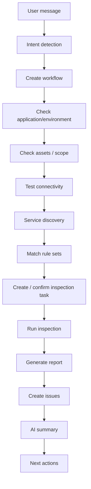

# OpsRadar Plataforma de inspección automatizada de operaciones

OpsRadar es una plataforma de inspección orientada a la producción, construida sobre FastAPI, PostgreSQL, Redis y Celery. El alcance actual en producción admite la inspección en tiempo real de hosts Linux/Unix mediante SSH, credenciales de recursos encriptadas, RBAC, registros de auditoría, exportación de informes y un asistente de IA orientado a tareas que impulsa los flujos de trabajo de inspección.

## Capturas de pantalla

### Inicio de sesión


### Visión general


### Inspección inteligente


### Centro de recursos


### Conjuntos de reglas


## Flujo de trabajo de IA

El asistente de IA es un orquestador de flujos de trabajo, no un chat bot de formato libre. Reconoce las acciones de OpsRadar, persiste el estado del flujo de trabajo y espera la confirmación del usuario cuando se requiere un diálogo modal o una acción de modificación.



Las devoluciones de llamada del flujo de trabajo mantienen el flujo activo después de que el usuario completa un modal:

- `environment_created`
- `asset_created`
- `asset_selected`
- `connection_tested`
- `services_discovered`
- `rules_confirmed`
- `task_created`
- `task_finished`

El asistente solo devuelve acciones y explicaciones respaldadas por datos de la plataforma. No inventa activos, problemas, informes ni resultados de reparación.

## Despliegue en producción

Prepara `.env` y los certificados TLS:

```bash
cp .env.example .env
mkdir -p deploy/certs
# put deploy/certs/tls.crt and deploy/certs/tls.key in place
```

Inicia la pila (stack):

```bash
docker compose up -d --build
docker compose exec opsradar-api python3 -m backend.app.cli init-admin
docker compose exec opsradar-api python3 -m backend.app.cli check
```

Abre `https://<server>/`.

La pila de producción contiene:

- `nginx`: Punto de entrada HTTPS y proxy inverso.
- `opsradar-api`: FastAPI + Gunicorn/Uvicorn, que sirve la API y el frontend.
- `opsradar-worker`: trabajador de Celery que ejecuta las tareas de inspección.
- `opsradar-beat`: escáner CronPlan y despachador de tareas.
- `postgres`: almacén de datos principal.
- `redis`: corredor de mensajes y backend de resultados de Celery.

## Desarrollo local

Inicia primero PostgreSQL y Redis locales, luego ejecuta:

```bash
python3 -m pip install -r requirements.txt
python3 -m backend.app.cli migrate
python3 -m backend.app.cli seed-builtin
python3 -m backend.app.cli init-admin
bash scripts/run_dev.sh
```

Ejecuta el trabajador en otra terminal:

```bash
bash scripts/run_worker.sh
```

Abre `http://127.0.0.1:4173/`.

## Comandos en tiempo de ejecución

```bash
python3 -m backend.app.cli migrate
python3 -m backend.app.cli seed-builtin
python3 -m backend.app.cli init-admin
python3 -m backend.app.cli check
```

## Configuración

- `OPSRADAR_ENV`: `development` o `production`.
- `OPSRADAR_SECRET_KEY`: Clave secreta para firma JWT.
- `OPSRADAR_ENCRYPTION_KEY`: Clave de encriptación AES-GCM para credenciales de recursos. Obligatorio en producción.
- `OPSRADAR_DATABASE_URL`: URL de SQLAlchemy para PostgreSQL.
- `OPSRADAR_REDIS_URL`: URL de Redis utilizada para verificaciones de servicios.
- `OPSRADAR_CELERY_BROKER_URL`: URL del corredor de mensajes de Celery.
- `OPSRADAR_CELERY_RESULT_BACKEND`: URL del backend de resultados de Celery.
- `OPSRADAR_API_WORKERS`: Número de trabajadores de Gunicorn.
- `OPSRADAR_WORKER_CONCURRENCY`: Concurrencia del trabajador de Celery.
- `OPSRADAR_SSH_CONNECT_TIMEOUT`: Tiempo de espera para la conexión SSH en segundos.
- `OPSRADAR_SSH_COMMAND_TIMEOUT`: Tiempo de espera para el comando SSH en segundos.
- `OPSRADAR_MAX_TASK_SECONDS`: Límite de tiempo forzado de la tarea de Celery.
- `OPSRADAR_PUBLIC_BASE_URL`: URL pública utilizada por los metadatos de despliegue.
- `OPSRADAR_CORS_ORIGINS`: Orígenes de navegadores permitidos separados por comas.
- `OPSRADAR_REPORT_DIR`: Directorio de salida de informes.
- `OPSRADAR_CHROME_PATH`: Ruta del ejecutable de Chrome/Chromium para la exportación a PDF.

## Implementado

- Persistencia exclusivamentesolo en PostgreSQL con migraciones de Alembic.
- Redis + Celery para la gestión de tareas y la ejecución del trabajador.
- Inspección real de shells SSH mediante AsyncSSH para recursos de host.
- Credenciales de recursos encriptadas con AES-GCM y salida de inspección enmascarada.
- Rutas de API protegidas con RBAC y registros de auditoría para eventos de escritura/seguridad.
- Pila de producción con Docker Compose y proxy TLS de Nginx.
- Exportación de informes en HTML, DOCX y PDF.
- Máquina de estados de flujo de trabajo de IA persistente con ejecución de tareas impulsada por devoluciones de llamada.

## Verificación

Con PostgreSQL, Redis, API y trabajadortrabajador en ejecución:

```bash
python3 scripts/check_services.py
python3 -m compileall backend
node --check assets/app.js
python3 scripts/smoke_test.py http://127.0.0.1:4173
```

Salida de la prueba de humo esperada:

```text
smoke ok
```

## Arquitectura

Consulta [docs/deployment/architecture.md](docs/deployment/architecture.md).

Para el diseño técnico completo a nivel de entrega, consulta [docs/TECHNICAL_DESIGN.md](docs/TECHNICAL_DESIGN.md).
