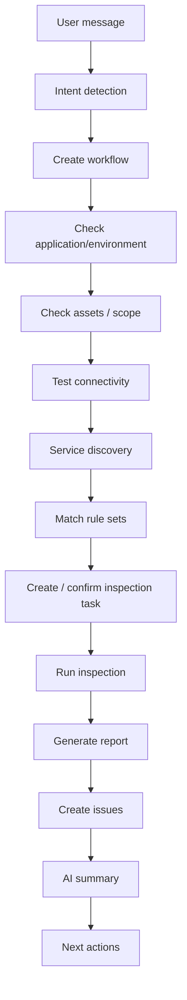

# OpsRadar 运维自动化巡检管理平台

OpsRadar is a production-oriented inspection platform built on FastAPI, PostgreSQL, Redis and Celery. The current production scope supports real Linux/Unix host inspection through SSH, encrypted resource credentials, RBAC, audit logs, report export, and a task-oriented AI assistant that drives inspection workflows.

## Screenshots

### Login


### Overview


### Smart Inspection


### Resource Center


### Rule Sets


## AI Workflow

The AI assistant is a workflow orchestrator, not a free-form chat bot. It recognizes OpsRadar actions, persists workflow state, and waits for user confirmation when a business modal or a mutating action is required.



Workflow callbacks keep the flow alive after the user completes a modal:

- `environment_created`
- `asset_created`
- `asset_selected`
- `connection_tested`
- `services_discovered`
- `rules_confirmed`
- `task_created`
- `task_finished`

The assistant only returns actions and explanations that are backed by platform data. It does not invent assets, issues, reports, or repair results.

## Production Deployment

Prepare `.env` and TLS certificates:

```bash
cp .env.example .env
mkdir -p deploy/certs
# put deploy/certs/tls.crt and deploy/certs/tls.key in place
```

Start the stack:

```bash
docker compose up -d --build
docker compose exec opsradar-api python3 -m backend.app.cli init-admin
docker compose exec opsradar-api python3 -m backend.app.cli check
```

Open `https://<server>/`.

The production stack contains:

- `nginx`: HTTPS entrypoint and reverse proxy.
- `opsradar-api`: FastAPI + Gunicorn/Uvicorn, serving API and frontend.
- `opsradar-worker`: Celery worker executing inspection tasks.
- `opsradar-beat`: CronPlan scanner and task dispatcher.
- `postgres`: authoritative data store.
- `redis`: Celery broker and result backend.

## Local Development

Start local PostgreSQL and Redis first, then run:

```bash
python3 -m pip install -r requirements.txt
python3 -m backend.app.cli migrate
python3 -m backend.app.cli seed-builtin
python3 -m backend.app.cli init-admin
bash scripts/run_dev.sh
```

Run the worker in another terminal:

```bash
bash scripts/run_worker.sh
```

Open `http://127.0.0.1:4173/`.

## Runtime Commands

```bash
python3 -m backend.app.cli migrate
python3 -m backend.app.cli seed-builtin
python3 -m backend.app.cli init-admin
python3 -m backend.app.cli check
```

## Configuration

- `OPSRADAR_ENV`: `development` or `production`.
- `OPSRADAR_SECRET_KEY`: JWT signing secret.
- `OPSRADAR_ENCRYPTION_KEY`: AES-GCM credential encryption key. Required in production.
- `OPSRADAR_DATABASE_URL`: PostgreSQL SQLAlchemy URL.
- `OPSRADAR_REDIS_URL`: Redis URL used by service checks.
- `OPSRADAR_CELERY_BROKER_URL`: Celery broker URL.
- `OPSRADAR_CELERY_RESULT_BACKEND`: Celery result backend URL.
- `OPSRADAR_API_WORKERS`: Gunicorn worker count.
- `OPSRADAR_WORKER_CONCURRENCY`: Celery worker concurrency.
- `OPSRADAR_SSH_CONNECT_TIMEOUT`: SSH connection timeout in seconds.
- `OPSRADAR_SSH_COMMAND_TIMEOUT`: SSH command timeout in seconds.
- `OPSRADAR_MAX_TASK_SECONDS`: Celery hard task time limit.
- `OPSRADAR_PUBLIC_BASE_URL`: public URL used by deployment metadata.
- `OPSRADAR_CORS_ORIGINS`: comma-separated allowed browser origins.
- `OPSRADAR_REPORT_DIR`: report output directory.
- `OPSRADAR_CHROME_PATH`: Chrome/Chromium executable path for PDF export.

## Implemented

- PostgreSQL-only persistence with Alembic migrations.
- Redis + Celery task dispatch and worker execution.
- Real SSH shell inspection through AsyncSSH for host resources.
- AES-GCM encrypted resource credentials and masked inspection output.
- RBAC-protected API routes and audit logs for write/security events.
- Docker Compose production stack with Nginx TLS proxy.
- HTML, DOCX and PDF report export.
- Persistent AI workflow state machine with callback-driven task execution.

## Verification

With PostgreSQL, Redis, API and worker running:

```bash
python3 scripts/check_services.py
python3 -m compileall backend
node --check assets/app.js
python3 scripts/smoke_test.py http://127.0.0.1:4173
```

Expected smoke output:

```text
smoke ok
```

## Architecture

See [docs/deployment/architecture.md](docs/deployment/architecture.md).

For the full delivery-level technical design, see [docs/TECHNICAL_DESIGN.md](docs/TECHNICAL_DESIGN.md).
